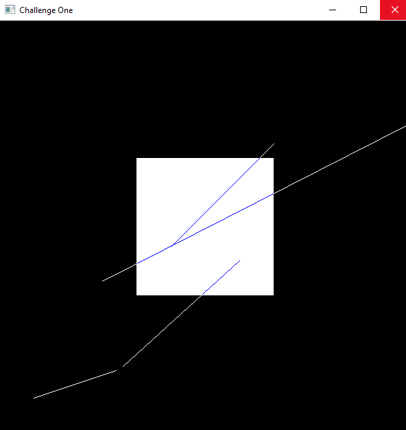

# Computer Graphics

This repository has the challenges and practices from the subject ST0275 - COMPUTACIÓN GRÁFICA from the EAFIT University.

## Challenge One

Make a line clipping algorithm, with the following requierements:

- Draw the the lines with the Bresenham's algorithm.
- Lines are hard coded.
- When a line is on the clipping area the color line has to be blue.

